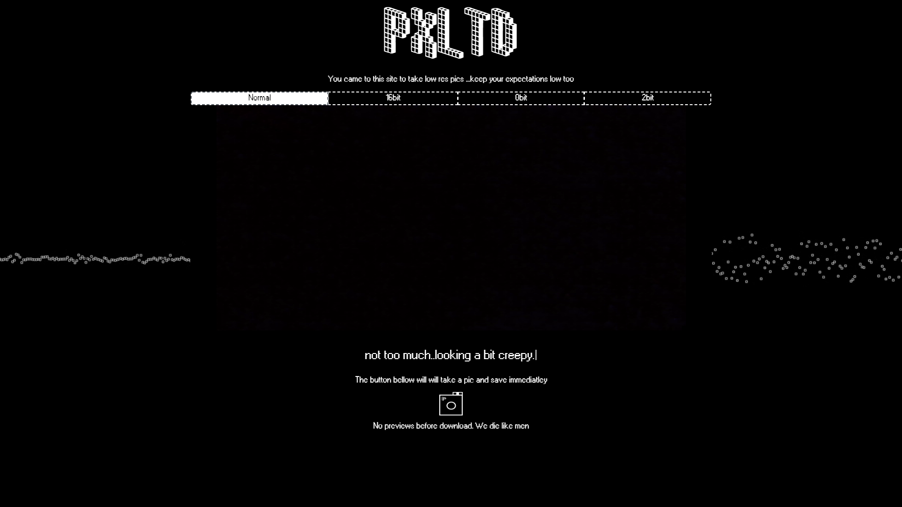
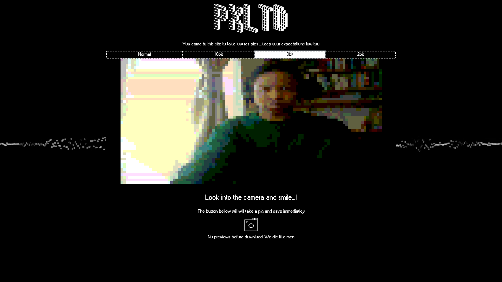
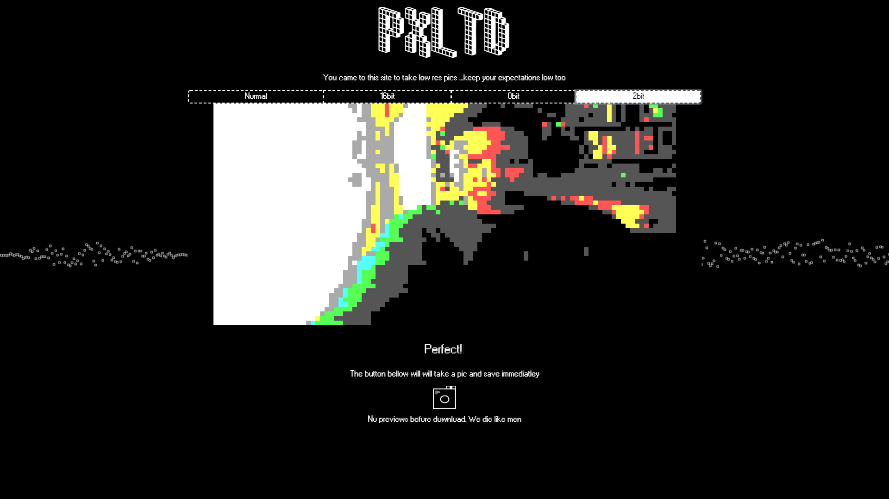

# PXLTD

   

   

  

## How to use it?(very simple, I promise):
1. Open the page
2. Make sure you are using a device with a functioning front facing camera
    1. PC- built in or external webcam
    2. Mobile - selfie (frint facing) camera
3. Select whichever "filter" you want to use from the options
    1. Normal
    2. 16bit
    3. 8bit
    4. 2bit
4. Smile
5. Press the camera icon to capture your beautiful face
    *Please note that images captured are atumatically saved to your device without a preview option
6. Have fun!

## Why did I make this?
I made this as my final project for the Tech Talent Accelerator Course. It was great way to show off my progress in technical acccumen but also integrate
my interest in creative computing.
 The main library used was p5.js, which is specifically built for creative computing. I aslo used the typewiter.jsfor the cool typing effect.

